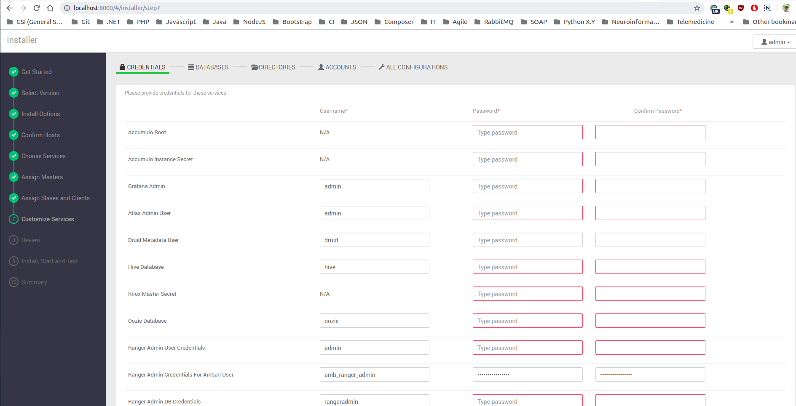
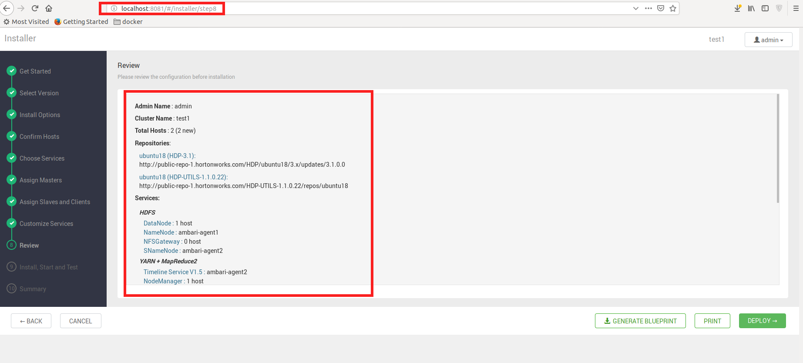

# Ambari Install Guide Step-by-Step

> ## Step-by-Step Guide for Ambari Agent/Server Deployment
>
> *Ambari Server version: 2.7.3.0*

## Docker Registry: Download Debian Image

```bash

docker pull debian:latest

docker run -it --name ambari-node -h ambari \
--cpus=1 \
--memory="1024MB" --memory-swap="2048MB" \
-p 8000:8000 \
-v /home/i-am/ambari/server-logs/:/var/log/ambari-server \
-v /home/i-am/ambari/agent-logs:/var/log/ambari-agent \
--net=hadoop-cluster --ip="192.168.0.100" \
--add-host="master:192.168.0.1" \
--add-host="slave-1:192.168.0.2" \
--add-host="slave-2:192.168.0.3" \
--add-host="slave-3:192.168.0.4" \
debian:ambari

# !!!Important: In order to Ambari being able to recognize agents:
# Agents must be declared in Ambari Server: '/etc/hosts'  
# e.g 192.168.0.1   master, ...

# Agents should have declared Ambari Server too: '/etc/hosts' 
# e.g: 192.168.0.100  ambari

# SSH Passwordless must exists between Ambari Server <---> Ambari Agents
# Read next section: 'Install Passwordless SSH'

```

## Install Passwordless SSH

```bash

sudo apt install wget openssh-server openssh-client

ssh-keygen -t rsa

cat ~/.ssh/id_rsa.pub >> ~/.ssh/authorized_keys

ssh localhost

```

```bash

# Master Node (Active TTY terminal)
ssh-copy-id -i $HOME/.ssh/id_rsa.pub slave-1

```

## *Warning*
>
> Default port is *'8080'*, preferred *'8000'*
>

### Published *Logs* Directories

> *Agent (logs)*: **/var/log/ambari-agent**
>
> *Server (logs)*: **/var/log/ambari-server**

---

## Download Ambari Repositories

```bash

wget -O /etc/apt/sources.list.d/ambari.list http://public-repo-1.hortonworks.com/ambari/debian9/2.x/updates/2.7.3.0/ambari.list

apt install gnupg2

apt-key adv --recv-keys --keyserver keyserver.debian.com B9733A7A07513CAD

```

```bash

apt update

apt-cache showpkg ambari-server
                     apt-cache showpkg ambari-agent
                     apt-cache showpkg ambari-metrics-assembly

apt install ambari-server

```

## Install *ambari-agent* in Master Node

```bash

apt install ambari-agent

```

---

## Install Ambari Agents manually on Debian 9

### Ambari Agent default settings (**/etc/ambari-agent/conf/ambari-agent.ini**)

```bash
apt update

apt install ambari-agent

nano /etc/ambari-agent/conf/ambari-agent.ini

# Agent Settings
# [server]
# hostname=<your.ambari.server.hostname> e.g 'ambari'
# url_port=8440
# secured_url_port=8441

```

---

## Install Ambari Server manually on Debian 9

### Ambari Server default settings (**/etc/ambari-server/conf/ambari.properties**)

---

## Ambari Server: Setup options

```bash
# Install JDBC library (default: PostgreSQL Embedded Mode)
apt install -y libpostgresql-jdbc-java
```


```bash

ambari-server setup --jdbc-db=postgres --jdbc-driver=/usr/share/java/postgresql-9.4.1212.jar

ambari-server setup

```


## *Ambari Server: default settings*

```bash

# ...
ambari-server.user=root
jdk.name=jdk-8u112-linux-x64.tar.gz
jdk1.8.desc=Oracle JDK 1.8 + Java Cryptography Extension (JCE) Policy Files 8
java.home=/usr/jdk64/jdk1.8.0_112 (downloaded from repositories)
# ...

# Property added
client.api.port=8000 (default: 8080)

# Database section
server.jdbc.database=postgres
server.jdbc.database_name=ambari
server.jdbc.postgres.schema=ambari
server.jdbc.user.name=ambari
server.jdbc.user.passwd=/etc/ambari-server/conf/password.dat

# Server webdir
webapp.dir=/usr/lib/ambari-server/web

```

---

## **(Optional)** Ambari Server: Solve Ports Conflicts

```bash

# Checks active processes in use by Java
ps -aux | grep java

kill <process-id> #PID

ambari-server start

```

---

## Ambari Server: Start Instance

```bash
# Start server instance
ambari-server start

```

### *Check Ambari Version*

```bash
cat /var/lib/ambari-server/resources/version # e.g '2.7.3.0'
```

---

## Ambari Server: Login page


## *Default Login*

```text
Username: admin
Password: admin
```

---

## Ambari Admin Section


---

## Ambari Cluster Creation


---

## Ambari Repository Selection


---

## Ambari Server Nodes Sign-In


---

## Ambari Cluster Components


---

## Ambari Server Suggested Roles (Slaves/Secondary Nodes)


---

## Ambari Server Suggested Services (Slaves/Secondary Nodes)


---

## Ambari Customized Services



---

## Ambari Directories Selection


---

## Ambari Account Settings


---

## Ambari All Configurations


---

## Ambari Review Settings



---

## Ambari Install Progress


---

## Ambari Documentation

- [Ambari: Download repositories](https://docs.hortonworks.com/HDPDocuments/Ambari-2.7.3.0/administering-ambari/content/amb_download_the_ambari_repository_on_debian_7.html)

- [Ambari: Install agents manually](https://docs.hortonworks.com/HDPDocuments/Ambari-2.7.3.0/administering-ambari/content/amb_install_the_ambari_agents_manually_on_debian_7.html)
- [Ambari: Install server manually](https://docs.hortonworks.com/HDPDocuments/Ambari-2.7.3.0/bk_ambari-installation/content/install-ambari-server-debian9.html)

- [Ambari: Setup server](https://docs.hortonworks.com/HDPDocuments/Ambari-2.7.3.0/bk_ambari-installation/content/set_up_the_ambari_server.html)